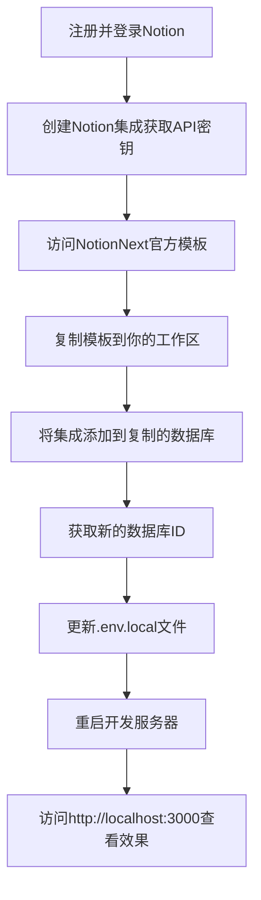

# NotionNext 博客配置总结

## 当前状态

我们已修改 NotionNext 的配置，使用默认模板数据库 ID 来测试系统功能。目前博客应该能在 http://localhost:3000 上正常访问，显示默认内容。

## 已创建的文档

为了帮助你完成博客配置，我们创建了以下文档：

1. **Notion连接故障修复.md** - 解释了原始数据库 ID 连接问题及修复方法
2. **创建Notion模板数据库.md** - 详细说明如何复制和使用 NotionNext 官方模板
3. **检查Notion连接.js** - 用于测试 Notion API 连接的脚本
4. **Notion连接排查指南.md** - 对常见问题的排查方法
5. **访问本地博客.md** - 本地开发服务器的访问说明

## 完整配置流程概览

要成功配置你的 NotionNext 博客，你需要完成以下步骤：



## 当前配置信息

```
NOTION_PAGE_ID=02ab3b8678004aa69e9e415905ef32a5 (默认模板ID)
NOTION_ACCESS_TOKEN=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
NEXT_PUBLIC_THEME=heo
NEXT_PUBLIC_LANG=zh-CN
```

## 自定义博客的后续步骤

1. **复制官方模板**：
   - 按照 `创建Notion模板数据库.md` 中的说明复制模板
   - 获取新的数据库 ID

2. **更新环境变量**：
   - 编辑 `.env.local` 文件，将 `NOTION_PAGE_ID` 改为你的新数据库 ID
   - 保存文件并重启服务器

3. **添加内容**：
   - 在 Notion 中编辑你的数据库，添加文章
   - 确保文章状态设置为 "Published"

4. **个性化设置**：
   - 编辑 `blog.config.js` 和 `conf/` 目录下的配置文件
   - 自定义网站标题、作者信息、联系方式等

5. **部署到生产环境**：
   - 推送代码到 GitHub
   - 注册 Vercel 账号
   - 导入你的 GitHub 仓库
   - 设置环境变量并部署

## 常见错误及解决方案

| 错误 | 可能原因 | 解决方案 |
|------|---------|---------|
| Notion page not found | 数据库 ID 错误或数据库不存在 | 检查 ID 是否正确，确保数据库存在 |
| API response error: Unauthorized | API 密钥无效或权限不足 | 检查 API 密钥，确保已将集成添加到数据库 |
| Invalid input: allPages should be arrays | 数据库结构不兼容 | 使用官方模板，确保字段格式正确 |

## 资源链接

- [NotionNext GitHub 仓库](https://github.com/tangly1024/NotionNext)
- [NotionNext 官方文档](https://docs.tangly1024.com/)
- [Notion API 文档](https://developers.notion.com/)
- [Heo 主题预览](https://preview.tangly1024.com/?theme=heo)

## 需要帮助？

如果你在配置过程中遇到任何问题，可以：

1. 查阅我们创建的相关文档
2. 运行 `检查Notion连接.js` 诊断 API 连接
3. 访问 [NotionNext GitHub Issues](https://github.com/tangly1024/NotionNext/issues) 寻找解决方案 